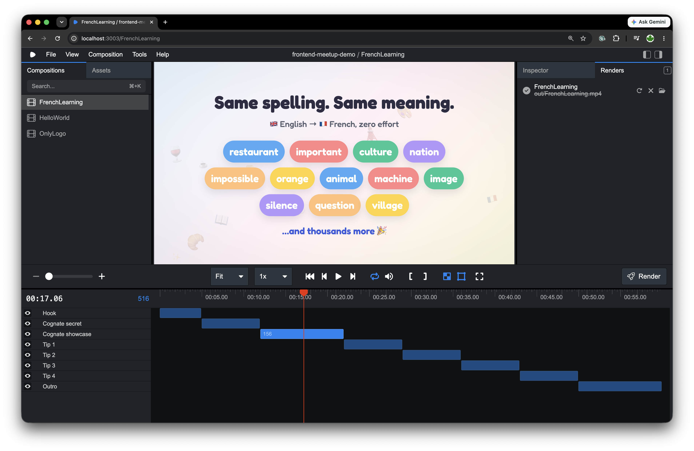

# French Learning — Remotion Video

An animated, 60-second educational explainer built with [Remotion](https://remotion.dev):
**"Learning French for English speakers without attending a language school."**

The video leans on the fact that English speakers already know thousands of French
words (cognates) and walks through practical, self-study quick wins. It's a
16:9, 1920×1080 @ 30fps piece with a playful, friendly visual style.

Built with [`remotion-bits`](https://www.npmjs.com/package/remotion-bits)
(animated text, counters, staggered motion, gradients), Tailwind v4, and the
Fredoka Google Font.

## Demo

[](https://youtu.be/1dB3NU0TSko)

▶️ **[Watch the full video on YouTube](https://youtu.be/1dB3NU0TSko)**

## Scenes

1. **Hook** — "No language school required."
2. **The secret** — an animated counter to 1700+ French words you already know.
3. **Cognate showcase** — words that are spelled the same and mean the same.
4. **Quick-win tips** — subtitles, spaced repetition, labeling your home, speaking early.
5. **Outro** — "Bonne chance !"

## Setup

Requires Node.js 18+.

```bash
npm install
```

## Develop

Start Remotion Studio to preview and edit the video live:

```bash
npm run dev
```

Then open the **FrenchLearning** composition from the sidebar.

## Render

Render the video to an MP4 file:

```bash
npx remotion render FrenchLearning out/FrenchLearning.mp4
```

Render a single still frame (useful for quickly checking a layout):

```bash
npx remotion still FrenchLearning out/frame.png --frame=200
```

## Lint

```bash
npm run lint
```

## Project structure

```
src/
  Root.tsx                     # Registers the FrenchLearning composition
  FrenchLearning/
    FrenchLearning.tsx         # Timeline: scenes assembled with <Sequence>
    theme.ts                   # Font, colors, gradients
    Background.tsx             # Animated gradient + floating emoji
    Scene.tsx / Reveal.tsx     # Fade wrapper and entrance helper
    ui.tsx                     # Pill, NumberBadge, Card
    scenes/                    # One file per scene
```
